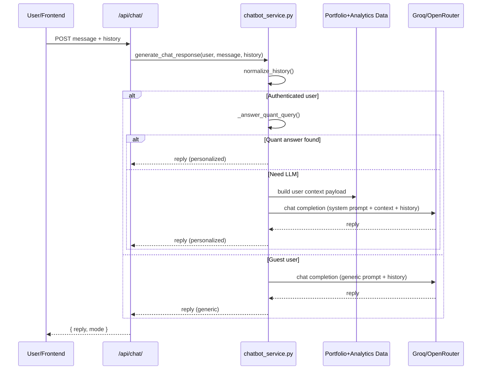

# Chatbot README

This document explains how the backend chatbot works in this project.

## Location

- Service logic: `backend/api/chatbot_service.py`
- API endpoint: `POST /api/chat/`
- API view: `backend/api/views.py` (`ChatbotAPIView`)
- Request serializer: `backend/api/serializers.py` (`ChatMessageSerializer`)

## What It Does

The chatbot supports two modes:

- `generic` mode for guest users
- `personalized` mode for authenticated users (uses portfolio and stock data)

It combines:

- Rule-based quantitative answers for ranking-style questions
- LLM responses (Groq / OpenRouter)
- Optional LangGraph routing orchestration

## Request Contract

`POST /api/chat/`

Request JSON:

```json
{
  "message": "Which stock has highest PE in my portfolio?",
  "history": [
    {"role": "user", "content": "Hi"},
    {"role": "assistant", "content": "Hello"}
  ],
  "session_id": "optional-session-id"
}
```

Response JSON:

```json
{
  "reply": "In your selected scope, TICKER (...) has the highest trailing P/E ...",
  "mode": "personalized"
}
```

## End-to-End Flow

1. `ChatbotAPIView` validates payload using `ChatMessageSerializer`.
2. `generate_chat_response(...)` receives user + message + history.
3. History is normalized (`_normalize_history`) and truncated for safety.
4. If user is authenticated, chatbot first tries `_answer_quant_query(...)` for direct numeric/ranking answers.
5. If not solved directly:
   - If LangGraph is available, it routes:
     - guest -> general prompt path
     - auth -> builds user context JSON then personalized prompt path
   - If LangGraph is unavailable, fallback prompt path is used.
6. Provider selection (`_call_chat_model`):
   - `CHAT_PROVIDER=groq` -> Groq
   - `CHAT_PROVIDER=openrouter` -> OpenRouter
   - `CHAT_PROVIDER=auto` -> Groq first, OpenRouter fallback
7. Reply is returned as `{ reply, mode }`.

## Detailed Dataflow

### Input Processing
- Raw inputs: `user` (Django User/AnonymousUser), `message` (str), `history` (list of dicts)
- History normalized to last 10 messages (user/assistant roles only, content truncated to 1000 chars)
- Base state created: `{message, history, is_authenticated, user}`

### Quantitative Short-Circuit (Authenticated Users Only)
- Runs only if `is_authenticated=True`
- `_resolve_metric_from_query()`: Maps phrases like "highest PE" → `"trailing_pe"`
- `_resolve_direction_from_query()`: Maps "highest"/"lowest" → `"max"`/`"min"`
- If both identified → calls `_answer_quant_query()`:
  - Builds user context payload:
    - Portfolios: `Portfolio.objects.filter(user=user)`
    - Stock holdings: `PortfolioStock` join table
    - Bulk data fetches: prices, forecasts, signals, sentiment, fundamentals, latest prices
    - Query-aware pruning via `_keyword_score()` to limit context
    - Structured as JSON: `{account_profile, summary, portfolios[], stocks[]}`
  - Applies inferred filters (geography/sector/portfolio from query text)
  - Finds min/max of requested metric among matching stocks
  - Returns formatted string if successful → exits with `{"reply": <answer>, "mode": "personalized"}`

### Routing & Context Building (When quantitative check fails or user is guest)
- Decision point: `LANGGRAPH_AVAILABLE?`
  - If False: Uses fallback path (direct LLM call)
  - If True: Uses LangGraph state machine
- For authenticated users requiring LLM processing:
  - Builds user context JSON (same as quantitative path data)
  - Serializes to string for LLM prompt injection
  - Contains: account info, portfolio summaries, detailed stock data with all metrics

### LLM Interaction (Convergence Point)
- Function: `_call_chat_model(system_prompt, history, user_message)`
- Provider selection:
  - `CHAT_PROVIDER=openrouter` → OpenRouter only
  - `CHAT_PROVIDER=groq` → Groq only
  - `auto/default` → Groq first, OpenRouter fallback
- Prompt construction:
  - Guest mode: General investing guidance prompt
  - Auth mode: Personalized prompt with `USER_CONTEXT_JSON:` prefix + context data
- API call to selected provider:
  - Sends: `[system_msg] + normalized history + [user_msg]`
  - Parameters: `model` (varies by provider), `temperature=0.35`, `max_tokens=450`, timeout
  - Returns: LLM response text or error fallback message

### Response Formatting
- Strips whitespace from LLM response
- Empty responses replaced with: `"I could not generate a response right now. Please try again."`
- Mode determined: `"personalized"` if authenticated, else `"generic"`
- Final output: `{"reply": <text>, "mode": "<personalized|generic>"}`

## Data Sources & Transformations

| Stage | Data Origin | Transformation |
|-------|-------------|----------------|
| **Input** | HTTP Request | History normalization & truncation |
| **Quant Check** | Portfolio + Analytics tables | Metric resolution + filtering → direct answer |
| **Context Build** | Portfolio, PortfolioStock + Analytics DB tables | Bulk-fetched metrics → JSON serialization |
| **LLM Input** | Context JSON + conversation history | Token-limited prompt assembly |
| **LLM Output** | Groq/OpenRouter API | Text response (with fallbacks) |
| **Final Output** | LLM output + auth flag | `{reply: str, mode: str}` |

All data accesses use standard SQL through Django ORM - **no vector database** is involved in this chatbot flow. The Medallion pipeline (Bronze/Silver/Gold) populates the underlying tables that the chatbot queries.

## Personalized Context (Authenticated)

For logged-in users, `_build_user_context_payload(...)` gathers live account context from DB/services:

- portfolios (`Portfolio`)
- stocks in portfolios (`PortfolioStock`)
- forecasts (`get_latest_forecasts_bulk`)
- signals (`get_latest_signals_bulk`)
- sentiment (`get_stocks_sentiment_bulk`)
- fundamentals (`get_fundamentals_bulk`)
- latest prices (`get_latest_price`)

This is compacted into JSON and injected into the system prompt.

## Quantitative Query Shortcut

Before using LLM for authenticated users, `_answer_quant_query(...)` handles many metric questions directly, e.g.:

- highest/lowest current price
- highest/lowest trailing PE
- highest expected change %
- predicted price comparisons
- simple geography/sector/portfolio filters inferred from query text

This improves speed, consistency, and reduces hallucination risk.

## LLM Providers and Env Variables

### Common

- `CHAT_PROVIDER` = `auto` | `groq` | `openrouter`

### Groq

- `GROQ_API_KEY`
- Model used in code: `llama-3.1-8b-instant`

### OpenRouter

- `OPENROUTER_API_KEY`
- `OPENROUTER_MODEL` (default in code: `openai/gpt-3.5-turbo`)
- `OPENROUTER_APP_NAME` (optional title/header)

## Sequence Diagram



## Notes

- Current chatbot is primarily **service/context-grounded**.
- Vector DB retrieval is not yet wired in this chatbot flow file.
- If provider keys are missing, chatbot returns configuration/helpful fallback messages.

## Quick Test

```bash
curl -X POST http://localhost:8000/api/chat/ \
  -H "Content-Type: application/json" \
  -H "Authorization: Token <YOUR_TOKEN>" \
  -d '{"message":"Which stock has highest PE in my portfolio?","history":[]}'
```
