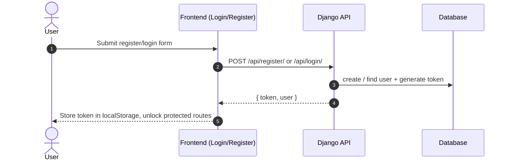
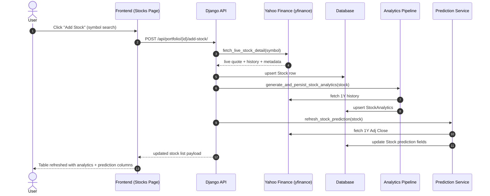
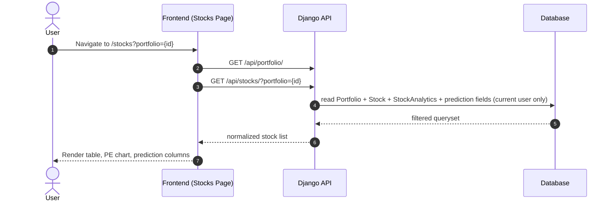
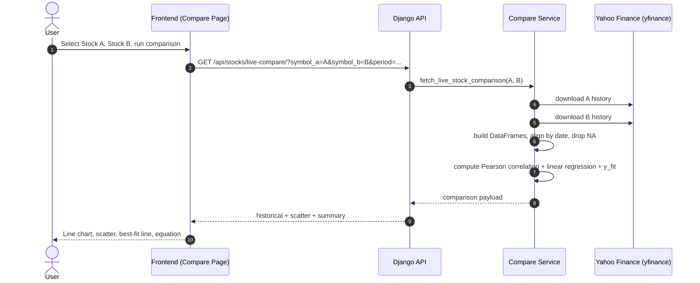
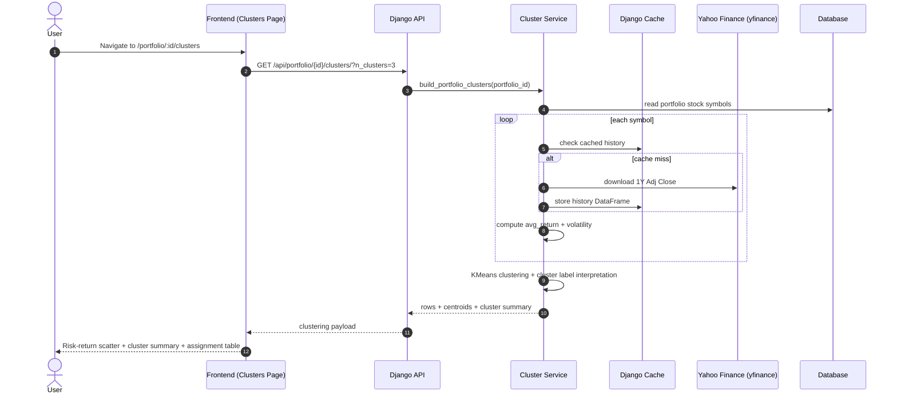
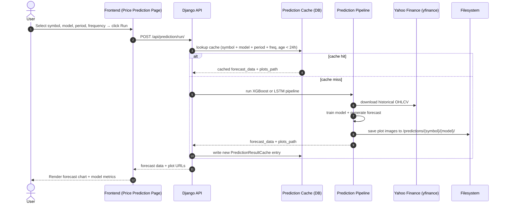
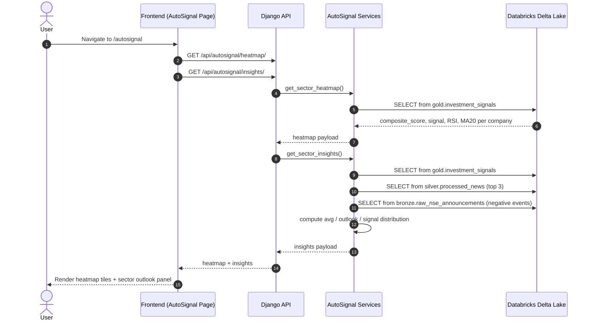
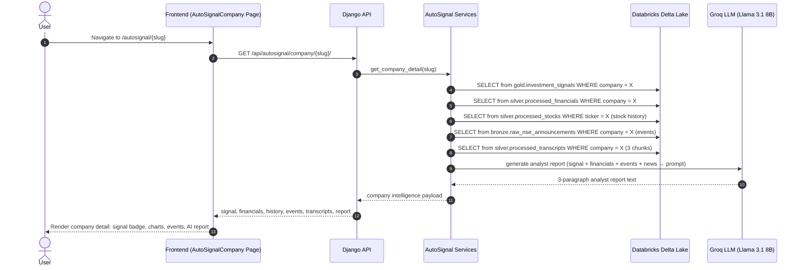
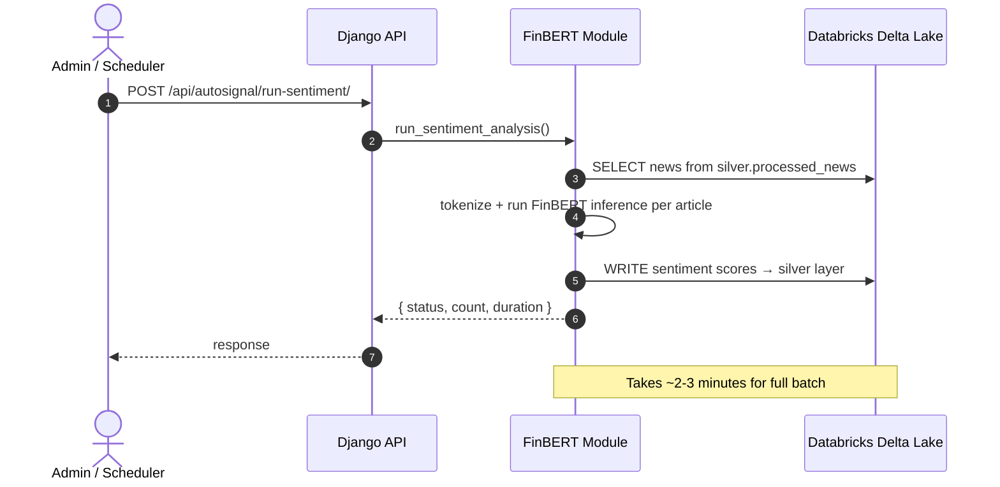
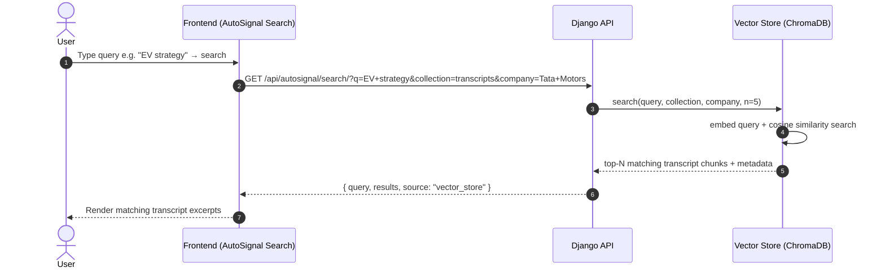

# Sequence Diagrams

## 1. Authentication Flow

---

## 2. Add Stock + Persist Analytics + Prediction

---

## 3. Portfolio Stocks Page Load

---

## 4. Compare Stocks (Live In-Memory Analysis)

---

## 5. Portfolio Clustering Analysis

---

## 6. Price Prediction (XGBoost / LSTM)

---

## 7. AutoSignal — Sector Heatmap & Insights

---

## 8. AutoSignal — Company Intelligence Page

---

## 9. AutoSignal — FinBERT Sentiment Inference

---

## 10. AutoSignal — Semantic Transcript Search

